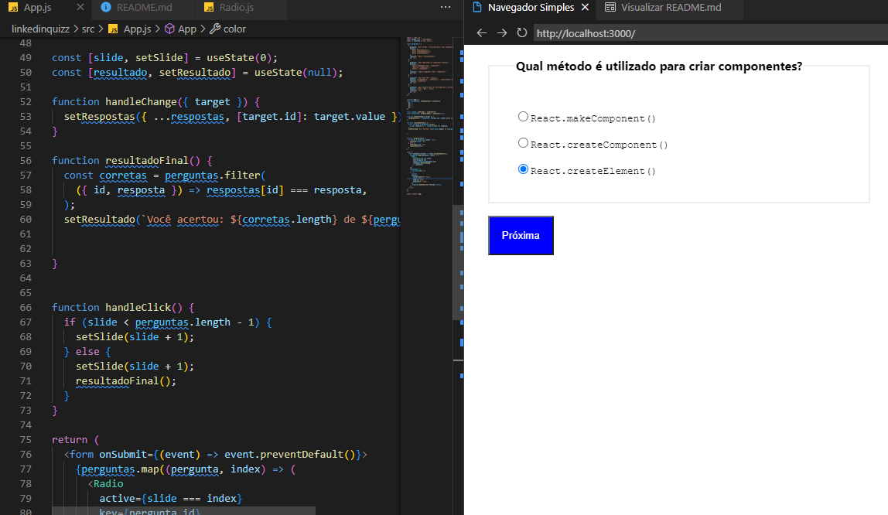

# Simple Linkedin Quizz using React.js

This project was bootstrapped with [Create React App](https://github.com/facebook/create-react-app).

## Available Scripts

In the project directory, you can run:

### `npm start`

Runs the app in the development mode.\
Open [http://localhost:3000](http://localhost:3000) to view it in your browser.

The page will reload when you make changes.\
You may also see any lint errors in the console.

<h2 id="resultados">Resultados de Desenvolvimento</h2> 
[Ver Resultado](https://johnbraga45.github.io/LinkedinQuizz/)

<h3 align="center">
    
</h3>

* Como a aplicação é de nível iniciante, ela é simples, mas está voltada para o uso de fomulários em react `(useForm)`, `componetes (Input, Select, Radio e Checkbox)` em react.

 [LinkedIn - Dionísio Braga](https://www.linkedin.com/in/dion%C3%ADsio-braga/) 
